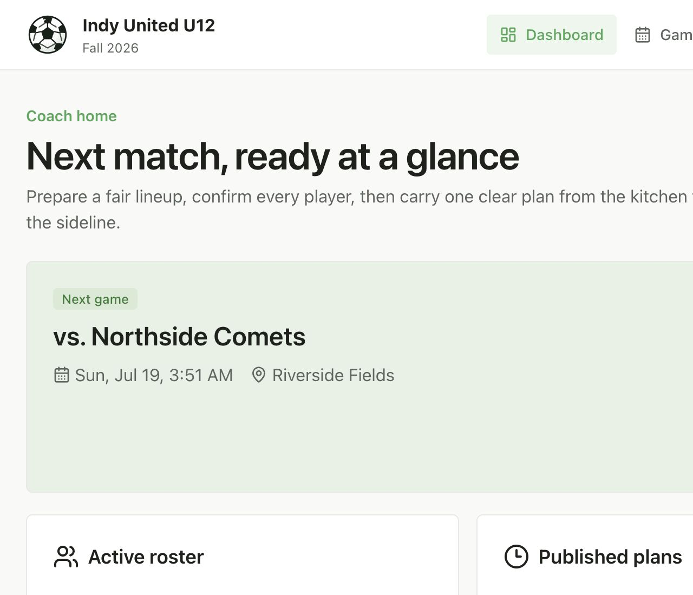
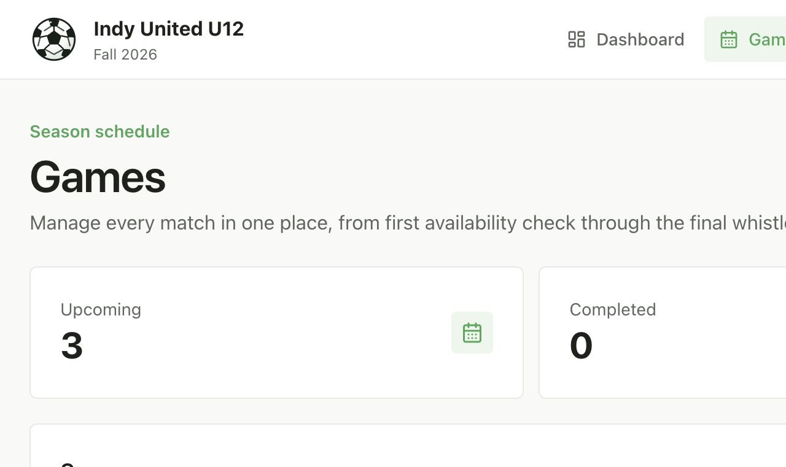
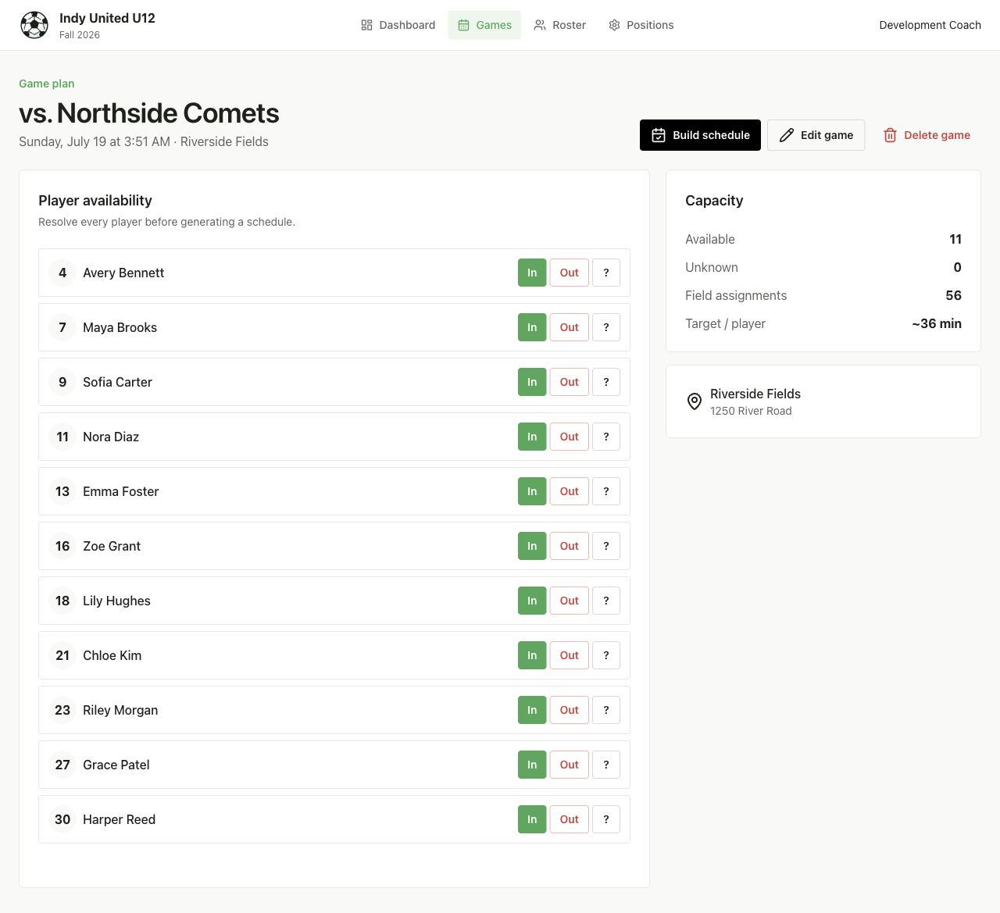
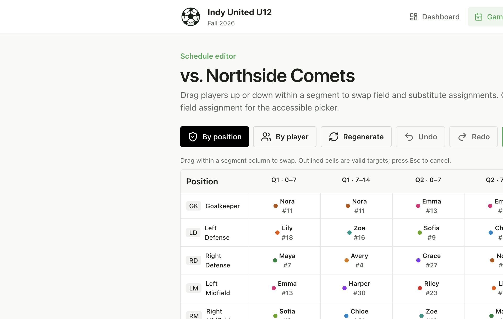
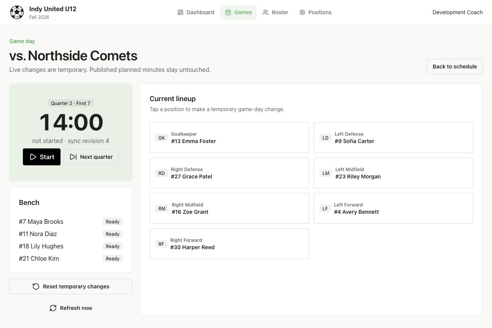
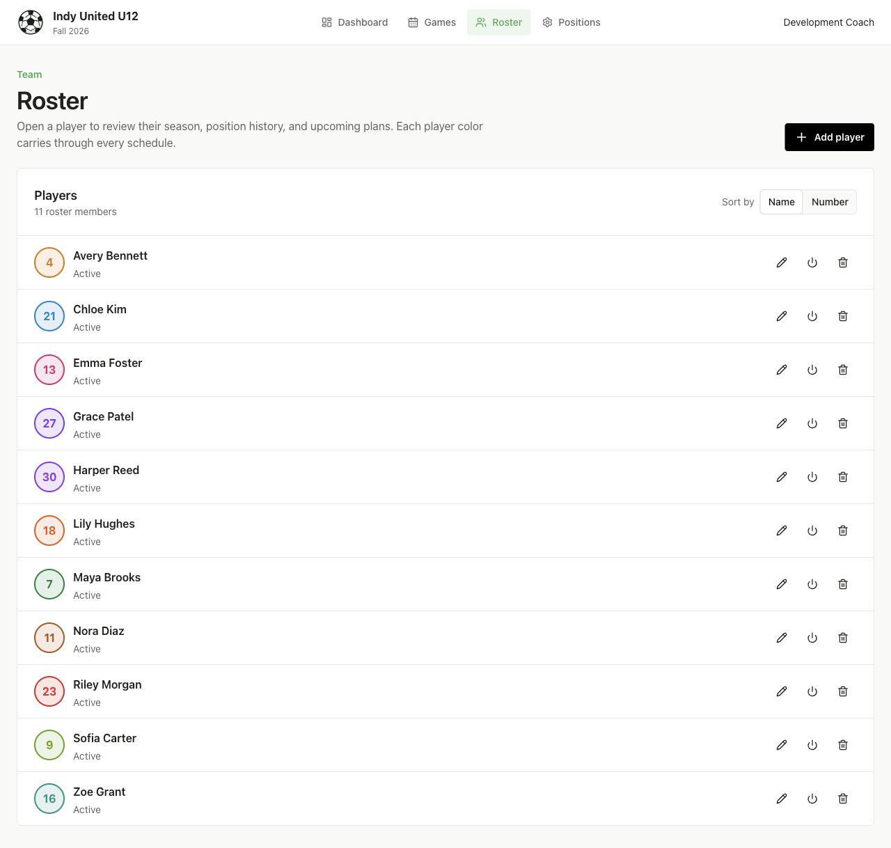
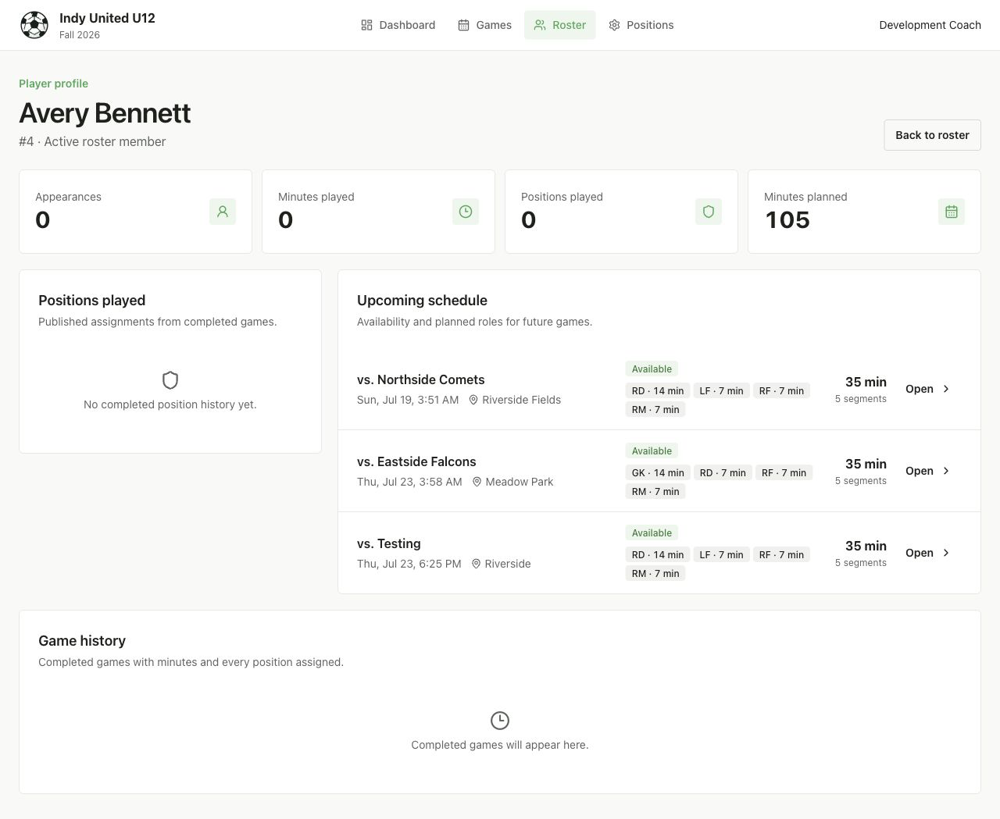
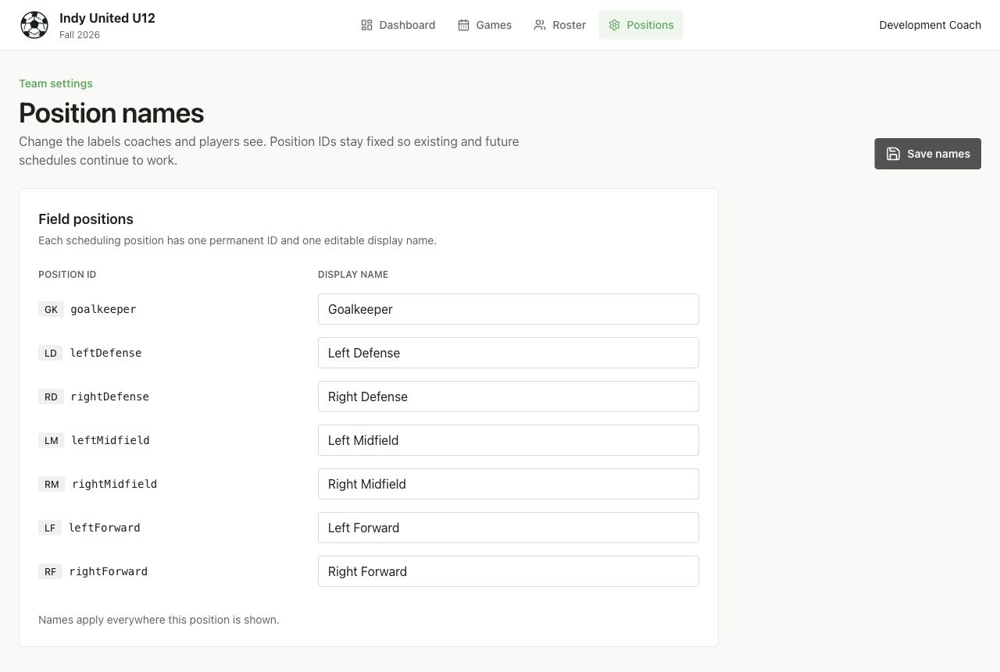

# Coach Companion

Coach Companion is a private, single-team workspace for planning soccer rotations and carrying the same plan through game day. In the words of the original project memo, it is “a tool that helps a soccer coach with all the small things that require some administration.”

The application replaces a spreadsheet in which every game is a sheet, every player is a row, and every column is a chunk of playing time. The useful part of that spreadsheet was the underlying mapping—a player, a time span, and a position. Coach Companion keeps that model, then makes it easier to generate, review, rearrange, print, and use from the sideline.

The practical goal is simple: once final availability is known, a coach should be able to build a valid schedule quickly, make a handful of judgment calls, and arrive at the game with one clear plan. The app does not try to automate away the coach. It gets the tedious first draft close, makes problems visible, and keeps manual changes easy.



## What it does

### Run the season from one dashboard

The dashboard keeps the next match, active roster count, published plans, and season-long planned minutes in one place. Planned totals come only from published schedules, so an unfinished draft does not distort the season view.

The Games page is the working list for the season. It separates upcoming and completed games, shows availability and schedule readiness, supports canceled games, and lets a coach update each game’s status without opening it first.



### Confirm the real roster for each game

Every game has its own opponent, date, arrival and start time, venue, address, notes, and player availability. Players can be marked in, out, or unknown before a rotation is generated. The game plan also shows the number of available players, unresolved responses, total field assignments, and the approximate minutes available per player.

This follows the actual planning sequence from the original memo: build the next schedule about a day before the game, once the coach knows who will and will not be there.



### Generate a fair eight-segment rotation

Games are modeled as four 14-minute quarters with a substitution point every seven minutes. A schedule assigns the available roster across seven field positions and a dynamic set of substitute rows for all remaining players.

The generator aims for a valid, even starting point:

- roughly balanced total minutes;
- variety across defense, midfield, forward, and goalkeeper;
- full-quarter goalkeeper assignments where possible;
- midfield changes that account for the extra running;
- no duplicate player or empty field assignment within a segment.

Quality checks keep the important exceptions visible without blocking intentional coaching decisions. The schedule flags large minute spreads, repeated midfield work, goalkeeper changes, more than 14 minutes in goal, and more than 14 minutes as a substitute. Blocking problems and advisory warnings are kept separate.

### Adjust the schedule without going back to Excel

The editor can render the same schedule by position or by player. Every player has a durable color that carries through the roster, schedule, and published view, making it easier to follow one player across the full game.

A coach can drag a player up or down within a seven-minute segment to swap field and substitute assignments. Clicking a cell opens an accessible picker for the same operation. The editor also supports undo, redo, regenerating a draft, and locking assignments that should survive regeneration.

Publishing creates the stable plan used by print, game-day mode, and season totals. A published plan is read-only, but **Edit again** creates an exact editable copy for small changes; it does not throw away the rotation. The current published plan stays active until the revision is explicitly published. If availability changes, the draft is marked stale so the mismatch cannot quietly pass as ready.



### Carry the plan to the sideline

The print view produces a clean copy for coaches, players, or a rainy game where pulling out a phone is less than ideal. The game-day view combines the quarter clock, current lineup, and bench in one screen.

During a game, a coach can tap a position and make a temporary replacement for an injury, rest, or unexpected absence. Those live overrides can be reset, and they never rewrite the published schedule or its planned-minute totals. The original plan remains available because the usual goal is to get the rotation back on track when possible.



### Keep the roster and the player story together

The roster supports adding, editing, activating, deactivating, and removing players. Jersey number, active status, and a unique schedule color live with the player rather than being copied into every game.

Each player has a profile that answers the questions that are difficult to see in a spreadsheet: upcoming availability, planned minutes, future positions, completed appearances, and position history. Completed-game summaries still come from the published plan; the app does not pretend that temporary sideline changes form an actual-minutes ledger.





### Use the team’s own position language

The seven scheduling position IDs remain stable, while their display names can be changed from the Positions page. A team can say “left back” instead of “left defense,” for example, without breaking old schedules or changing source code. Updated names flow through schedule, live, print, and player-profile views.



### Share one private coaching workspace

The deployed app supports exactly two configured coach accounts with private credentials. Both coaches work from the same file-backed team data, and the game-day view refreshes shared state periodically or on demand. Local development provides a development-coach bypass; production requires configured credentials.

## Product workflow

1. Add the roster and give each player a jersey number and identifying color.
2. Add the season’s games and confirm the logistics.
3. Mark every player’s availability for the next game.
4. Generate a rotation, review quality checks, and make any coach-driven swaps.
5. Publish the schedule, then print it or open game-day mode.
6. Run the clock and make temporary substitutions without losing the planned rotation.
7. Mark the game complete so player and season history use that game’s published assignments.

## Technology and data

- [SolidStart](https://start.solidjs.com/) and SolidJS with server actions and SSR-safe data loading
- Park UI / Ark UI components styled with Panda CSS tokens
- Zod contracts at request, action, and persisted-data boundaries
- File-backed JSON storage under `APP_DATA_DIR`
- Vitest, TypeScript, and ESLint verification
- Production Docker image and Compose configuration with a persistent `/app/data` volume

The soccer domain data is intentionally small and legible: team settings, players, games, availability, versioned schedules, and live-game state. Published schedules are immutable snapshots. Draft revisions and temporary live overrides sit beside them instead of silently changing the source plan.

## Local development

Requirements:

- Node.js 22 or newer
- pnpm 11.7.0

Install and start the app:

```bash
pnpm -C app install
cp app/.env.example app/.env
pnpm -C app dev
```

The development server writes its current URL and process details to `live-server-details.json`. By default the site is available at `http://localhost:3000`.

Useful checks:

```bash
pnpm -C app verify
pnpm -C app build
pnpm -C app start
```

`verify` runs TypeScript, the Vitest suite, and ESLint. Panda-generated files live under `app/styled-system/` and should be regenerated with `pnpm -C app prepare`, not edited by hand.

## Deployment with Coolify

The repository is ready to deploy from its root `Dockerfile`. A normal Coolify deployment should build the `runtime` image, route HTTPS traffic to container port `3000`, and keep `/app/data` on persistent storage. The relevant Coolify references are its [Dockerfile build-pack guide](https://coolify.io/docs/applications/build-packs/dockerfile), [environment-variable guide](https://coolify.io/docs/knowledge-base/environment-variables), and [persistent-storage guide](https://coolify.io/docs/knowledge-base/persistent-storage).

### 1. Create the application

In Coolify, create an application from this Git repository and use the repository root as the base directory.

- Build pack: **Dockerfile**
- Dockerfile location: `/Dockerfile`
- Internal port: `3000`
- Health-check path, if you enable one: `/login`
- Domain: the HTTPS domain that will serve Coach Companion

Coolify owns the public reverse proxy, so `APP_PORT` is not needed there. `APP_PORT` only changes the host-side port when running this repository with Docker Compose.

### 2. Add persistent storage

Mount a persistent Coolify volume at:

```text
/app/data
```

Then set `APP_DATA_DIR=/app/data`. This directory holds the soccer store, coach sessions, schedules, and live-game state. Without the mount, the app can start normally but its data may disappear when Coolify replaces the container during a deployment.

### 3. Set the required environment variables

These are the only values that require deployment-specific attention for the soccer application:

| Variable | Required? | Coolify value |
| --- | --- | --- |
| `COACH_CREDENTIALS_JSON` | **Yes** | A one-line JSON array containing exactly two coaches. IDs and display names must be unique, and every password must be at least 16 characters. Store it as a secret. |
| `APP_DATA_DIR` | **Yes** | `/app/data` |
| `APP_BASE_URL` | **Yes for the Dockerfile build pack** | Set to `$COOLIFY_URL` or the literal final HTTPS origin, such as `https://coach.example.com`. |
| `COACH_CREDENTIAL_VERSION` | Recommended | Start with `1`. Change it whenever credentials are rotated to invalidate all existing sessions. |

Use raw JSON in the Coolify value field—do not include the outer single quotes shown in `.env` file examples:

```json
[{"id":"coach-one","displayName":"Coach One","password":"replace-with-a-long-unique-password"},{"id":"coach-two","displayName":"Coach Two","password":"replace-with-another-long-unique-password"}]
```

Replace both example passwords before deploying. The application deliberately refuses to load the coach list unless the value contains exactly two valid coach records.

Coolify provides the predefined `COOLIFY_URL` variable for applications, but Coach Companion does not read that name directly. In Coolify, add `APP_BASE_URL=$COOLIFY_URL` after assigning the production domain, or enter the literal HTTPS origin. Coolify expands references to its predefined variables.

Coach Companion prefers `SERVICE_URL_APP` when it exists, then falls back to `APP_BASE_URL`. `SERVICE_URL_APP` follows Coolify’s magic-variable convention for a service named `app` in a **Docker Compose** deployment. It is not the URL setting to rely on for the recommended Dockerfile build pack. If you later switch to the Compose build pack, verify the resolved value and do not configure it to conflict with `APP_BASE_URL`.

### 4. Confirm the runtime defaults

The Docker image and Compose file already provide these values. They normally do not need to be entered in Coolify, but these are the expected production settings if you choose to declare them explicitly:

| Variable | Production value | Notes |
| --- | --- | --- |
| `NODE_ENV` | `production` | Disables the local development-coach bypass and requires real login. |
| `HOST` | `0.0.0.0` | Allows Coolify’s proxy to reach the Node server. |
| `PORT` | `3000` | Must match the internal port configured in Coolify. |
| `PRODUCT_NAME` | `Coach Companion` | Used by inherited application infrastructure. |
| `SERVICE_URL_APP` | Usually unset | Used when deploying the repository as a Coolify Docker Compose service stack; it takes precedence over `APP_BASE_URL`. |

### 5. Leave build-time settings at their defaults

`BASE_PATH` and `CI_SSG_PRERENDER` are Docker build arguments, not ordinary runtime settings. A standard Coolify deployment on its own domain should omit both and use the Dockerfile defaults:

| Build argument | Default | When to change it |
| --- | --- | --- |
| `BASE_PATH` | `/` | Only when intentionally serving the app below a URL prefix. Changing it requires a rebuild. |
| `CI_SSG_PRERENDER` | `false` | Used for the static component-explorer build, not the server deployment. |

Setting either variable only after the image is built will not change the compiled application. If one must be overridden in Coolify, enable its **Build Variable** setting and rebuild the image.

### 6. Omit unused starter variables

The Compose file still declares optional integrations inherited from the starter repository. The active soccer application does not require them, so they can be omitted from Coolify:

- `OPENAI_API_KEY`, `OPENAI_MODEL`, `OPENAI_HEAVY_MODEL`
- `EMAIL_DELIVERY`, `RESEND_API_KEY`, `EMAIL_FROM`
- `SUPER_USER_EMAIL`
- `STRIPE_SECRET_KEY`, `STRIPE_WEBHOOK_SECRET`, `STRIPE_PRICE_CREDIT_PACK`
- `CREDIT_PACK_CREDITS`, `CREDIT_PACK_AMOUNT_CENTS`, `CREDIT_PACK_CURRENCY`

Configure those only if the corresponding starter integration is deliberately activated later.

### 7. Deploy and verify

After the first deployment:

1. Open the HTTPS domain and confirm the login page appears instead of the development-coach session.
2. Sign in with each of the two configured coach accounts.
3. Confirm the dashboard loads the shared team workspace.
4. Add or change a harmless record, restart or redeploy the application, and confirm the change remains. This verifies the `/app/data` mount.
5. Open a game schedule and game-day mode from a second session to confirm both coaches can read the same stored state.

### Docker Compose outside Coolify

For a direct Docker deployment, create a root `.env` with the same production variables and run:

```bash
docker compose up --build
```

Compose maps the app to port 3000 by default and persists `/app/data` in its `starter-data` named volume. Change the host-side port with `APP_PORT`.

## Project background

The product started as a spoken walkthrough of the existing Excel process and the small administrative burdens around coaching an under-10 team. That source is preserved in [the requirements and workflow transcript](docs/plans/soccer-coach-companion-app-requirements-and-workflow.md). The decisions that turned it into routes, data structures, and workflows are in [the detailed product and implementation plan](docs/plans/soccer-coach-companion-app-detailed-product-and-implementation-plan.md).

Implementation notes and focused retrospectives live under [`docs/`](docs/), including schedule generation, drag-and-drop editing, game management, player details, position labels, authentication, and published-schedule revisions.
